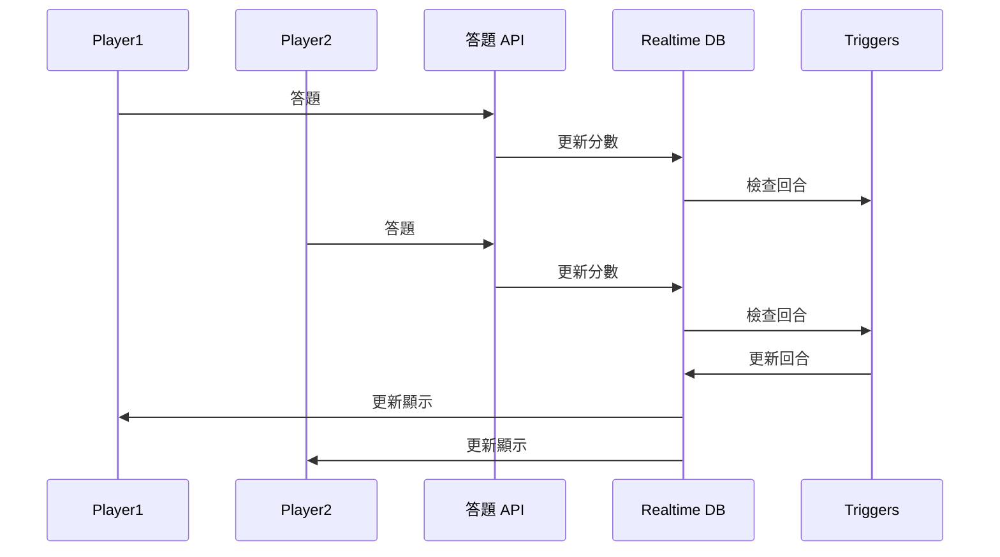

# Lapsee 媒體小鎮
網站連結: [https://lapsee.web.app](https://lapsee.web.app)  
Cloud Function: repo: [https://github.com/xieyou0608/lapsee-functions](https://github.com/xieyou0608/lapsee-functions)  
此專案與 Lapsee 媒體素養教育組織合作，打造 Lapsee 專屬記憶翻牌及知識王小遊戲


## setup
environment: node.js 18
```
npm install && npm start
```

## 使用技術
前端使用 React 相關生態系開發
- React.js, , React Router, Redux
- CSS Module, Material UI, Styled API  

為了減輕維護難度，使用 Firebase BaaS 功能打造後端
Firebase 
- Realtime Database
- Authenticaion
- Cloud Functions
- Hosting

## 雙人連線對戰功能(知識王)
使用 Realtime Database 與 Functions Triggers 打造  


## 排行榜功能
資料庫的 Rank 存取規則設定 read: true, write: false  
可使用 RTDB REST API 直接獲取排行榜  
更新則須透過 Cloud Functions  
```POST /rank/:game```

## 題庫管理(知識王)
資料庫 Questions 規則設定為管理員才可存取  
玩家則必須透過 Cloud Functions 存取  
獲得隨機十個題目   
```GET /questions/random``` 

#### 更新題目
使用 Firebase Authentication 提供管理員帳號  
管理員使用 RTDB REST API 附帶 token 可直接讀寫 Questions

## 翻牌及答對動畫
使用 React.js, CSS Modules 做出翻牌動畫


